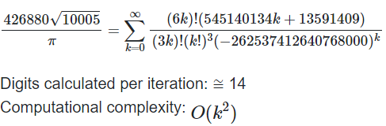

Introduction
====================================
In the sixth series of exercises, there are 2 problems.
* __CalculatePi__
* __Semaphore__

CalculatePi
-----------
+ <font color=A0A029>__Brief History of π__</font>

Approximations for the value π were known to the ancient Babylonians, Egyptians, Indians, Greeks, and Chinese. The earliest records of π date back to the Babylonians (c. 2000 BCE), they referred to π as the fraction 25/8 = 3.125, out by 0.528%. Roughly around the same time, the Egyptians were using a different fraction 256/81 = 3.160, out by 0.601%. Indian scriptures contained in the Vedic Shatapatha Brahmana book (c. 800 BCE) referred to π as 339/108 = 3.138̇̇̇̇̇̇̇̇, out by 0.086%. Approximately five hundred years later (c. 250B CE), Archimedes of Syracuse used inscribed and circumscribed polygons, and calculated π to be 22/7, out by 0.040%. This easy to remember approximation was still recently in use for performing rough calculations until the introduction of the modern electronic calculator. Zu Chongzhi a Chinese polymath (c. 500 CE) some seven hundred years later derived two approximations. The first being the same as the one Archimedes found, and later the more impressive approximation of 355/113 = 3.14159292, being accurate to seven decimal places, an incredible feat for the time.

The beginning of the European renaissance (c. 1400 CE), and the introduction of the Hindu-Arabic numeral system by Fibonacci at around the same time, paved the way for major advances in mathematics in Europe. By the late sixteenth century, European mathematicians were using infinite series equations to calculate the value of π with greater and greater precision. Since then, a variety of ingenious methods for approximating π, including the use of prime numbers, and even the use of the golden ratio have come to pass.
+ <font color=A0A029>__Choosing the most optimal algorithm__</font>

The following table shows the per digit time taken (in milliseconds) for each famous algorithm when calculating π to a differing number of digits.


| <font color=D6B5B5>Algorithm |	<font color=D6B5B5>500 Digits|<font color=D6B5B5>1000 Digits|	<font color=D6B5B5>5000 Digits|
|-------------------------------|-----------|-----------|------------|
| <font color=#F9C784>_Newton-Euler_                |16.51 ms|63.63 ms|2017.41ms|
| <font color=#F9C784>_Madhava_                     |0.38 ms|1.22 ms|32.51 ms|
| <font color=#F9C784>_Ramanujan_                   |0.04 ms|	0.14 ms|	3.96 ms|
| <font color=#F9C784>_Chudnovsky_                  |0.02 ms|	0.08 ms|1.71 ms|
| <font color=#F9C784>_BBP_                         |0.25 ms|	0.84 ms|21.13 ms|


As can be seen, Chudnovsky's algorithm has the lowest processing time compared to other algorithms.

+ <font color=A0A029>__Chudnovsky Algorithm__</font>

David Volfovich Chudnovsky (c. 1947) and Gregory Volfovich Chudnovsky (c. 1952) are American mathematicians and engineers known for their world-record mathematical calculations and developing the Chudnovsky algorithm used to calculate the digits of π with extreme precision. The Chudnovsky algorithm published in 1988, is based on the Ramanujan algorithm, but converges at about twice the rate. It is the Chudnovsky algorithm that has been used to calculate the world record for π to 31.4 trillion digits.

Equation for the Chudnovsky algorithm:



+ <font color=A0A029>__Code in Java__</font>

The general structure of the CalculatePi class is as follows:

```java
public class PiCalculator {
    public static class CalculationPiInv implements Runnable{ }
    public BigDecimal factorial(int n){}
    public static synchronized BigDecimal addToSum(BigDecimal value){}
    public static String calculate(int floatingPoint){}
    public static void main(String[] args) {}

}
```
- + Each thread that enters the "CalculationPiInv" class calculates one term of the right-hand side of the sigma equation of the algorithm.
- + I defined a "static" variable called "sum" for the "PiCalculator" class. Each "thread" that performs its calculations, passes it to the "addTOSum" function. This function adds this value to the "sum" variable.
    
    The reason for defining this function is to make it "synchronized". Threads must be added to "sum" one by one.
- + The "calculate" function is called from the side of the "main" function.

    The "calculate" function receives an "Integer" value as an input. This value determines how accurately the "Pi" number will be displayed as an output.

For more explanation, we explain the "CalculationPiInv" class and the "calculate" function:

1) <font color=7DD6A7>"CalculationPiInv":</font>

    ```java
    static MathContext mc = new MathContext(1500);
    public static class CalculationPiInv implements Runnable{
        int n;


        public CalculationPiInv(int n) {
            this.n=n;
        }

        @Override
        public void run() {

            BigDecimal b2=new BigDecimal("545140134",mc).multiply(new BigDecimal(n),mc).add(new BigDecimal("13591409",mc),mc);
            BigDecimal b3=factorial(6*n);
            BigDecimal b4=factorial(3*n);
            BigDecimal b5=factorial(n);
            BigDecimal b6=new BigDecimal("-262537412640768000",mc).pow(n,mc);

            BigDecimal result=b2.multiply(b3,mc).divide(b4.multiply(b5.pow(3,mc),mc).multiply(b6,mc),mc);

            addToSum(result);

        }
    }
    ```
We defined each statement of arithmetic operations in the "BigDecimal" class. 

BigDecimal can handle very large and very small floating point numbers with great precision but compensating with the time complexity a bit.
For each operator, I set the accuracy value of "ms = 1500".

I chose this value considering that in the "PiCalculatorTest" class, the number "Pi" is calculated up to 1000 accuracy.


2) <font color=7DD6A7> "calculate": </font>

    ```java
    public static String calculate(int floatingPoint)
    {
        // TODO
        ExecutorService threadPool = Executors.newFixedThreadPool(4);
        sum=new BigDecimal(0);


        for (int i=0;i<1000;i++){
            CalculationPiInv task=new CalculationPiInv(i);
            threadPool.execute(task);
        }
        threadPool.shutdown();


        try {
            threadPool.awaitTermination(1000, TimeUnit.MILLISECONDS);
        } catch (InterruptedException e) {
            e.printStackTrace();
        }

        BigDecimal b1=new BigDecimal("426880",mc).multiply(new BigDecimal("10005",mc).sqrt(mc));
        BigDecimal Pi=b1.divide(sum,mc);
        Pi = Pi.setScale(floatingPoint, RoundingMode.FLOOR);

        System.out.println(Pi);
        return Pi.toString();
    }
    ```
   
In this function, we defined the "threadPool" object and set the number of "threads" that can be done in parallel to four.Then we "execute" 1000 "threads".

When all "threads" of "threadpool" are done, wait for 1000 and finally the next lines of this function are executed.

The final lines calculate the final value of "Pi".

Semaphore
-----------
+ <font color=A0A029>__Brief History of Semaphore in Java__</font>

A semaphore controls access to a shared resource through the use of a counter. If the counter is greater than zero, then access is allowed. If it is zero, then access is denied. What the counter is counting are permits that allow access to the shared resource. Thus, to access the resource, a thread must be granted a permit from the semaphore.

+ <font color=A0A029>__Semaphore code__</font>

To start, we create a 5x2D object of type "array".
```java
  static String result[][]=new String[5][2];
```
We create an object of "Semaphore" and set the number of "permits = 2".
We create 4 "threads" and "start" all of them and then "join" them. Each "thread" is executed in the "operator" class. In this class, we change the name of each "thread" according to the "constructor" entry. In this class, a counting variable named "count" is defined as "static". Every time a "sem" acquires, It reads "count" and the "result" array is filled. Then "count" becomes "count ++" and then "sem" becomes "release".

Finally, the "main" function displays the "result" value.

Links
---

- Semaphore in Java
  
    <https://www.youtube.com/watch?v=g19pjkJyGEU>
  
    <https://www.geeksforgeeks.org/semaphore-in-java/>
- Joining Threads in Java

    <https://www.geeksforgeeks.org/joining-threads-in-java/>
- README

    <https://agea.github.io/tutorial.md/>

    <https://www.markdownguide.org/hacks/#:~:text=Markdown%20doesn't%20allow%20you,or%20the%20hexadecimal%20%23RRGGBB%20code.&text=font%3E-,The%20rendered%20output%20looks%20like,This%20text%20is%20red!>

    <https://www.markdownguide.org/extended-syntax/#:~:text=for%20more%20information.-,Tables,either%20end%20of%20the%20row.&text=Cell%20widths%20can%20vary%2C%20as%20shown%20below.>
- π

    <https://i4cy.com/pi/>